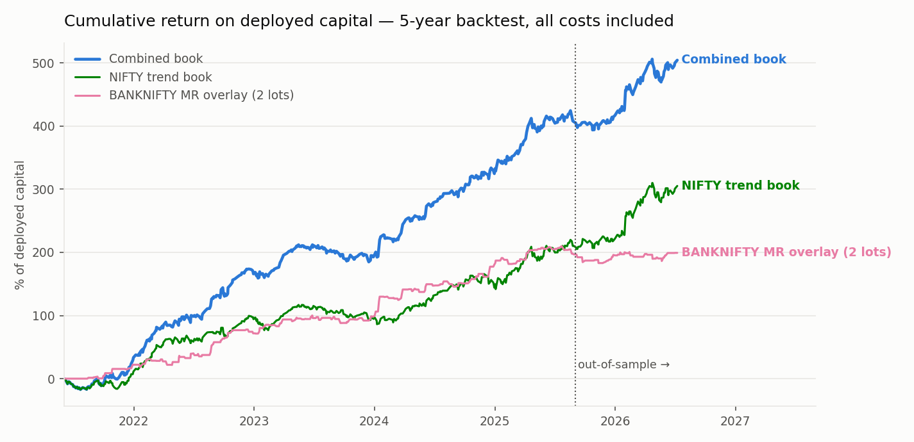
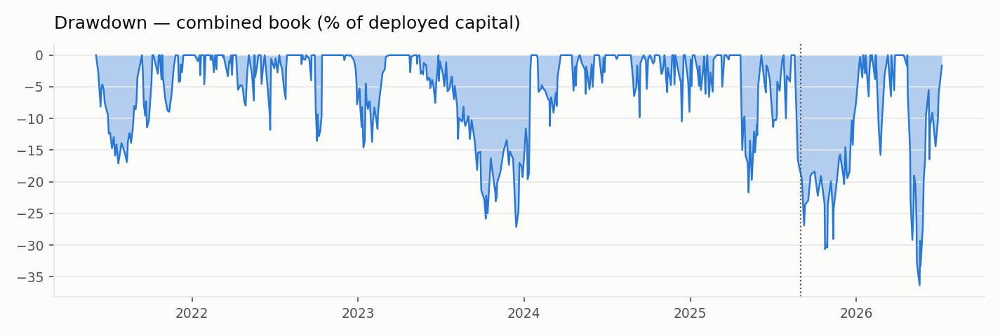
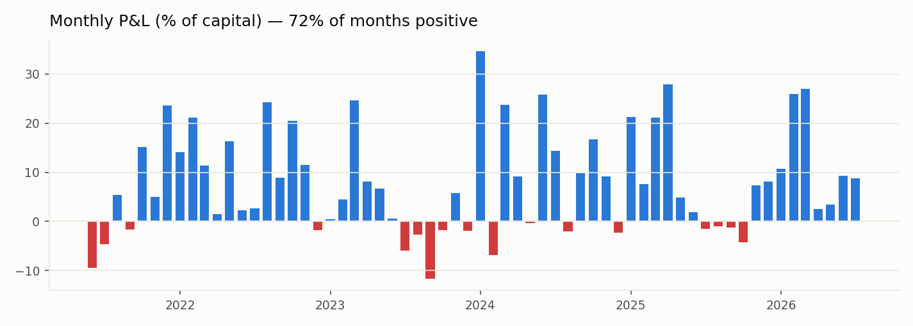

# Systematic Index-Options Research — Results Showcase

A 5-year research program building, validating, and stress-testing short-premium option
strategies on Indian index options (NSE — NIFTY weeklies and BANKNIFTY). This repo
documents the **process and audited results**. Signal definitions, parameters, strikes,
and exit levels are intentionally withheld — what's public here is the engineering, the
validation rigor, and the numbers.

> **TL;DR** — Final portfolio: two defined-risk premium-selling trend legs on NIFTY
> weekly options + a mean-reversion overlay on BANKNIFTY (daily-P&L correlation
> **−0.08**). **Sharpe 3.43, Calmar 13.9, 6/6 years positive, 73% positive months,
> ₹8.3L total P&L on ~₹1.65L deployed margin — after brokerage, all government
> charges, and honest settlement.**

> **Status (Jul 2026):** the final portfolio is deployed and **algorithmically
> paper-traded in real time** on a cloud box against live broker WebSocket feeds —
> real quotes, simulated fills, full cost accounting — as the last validation stage
> before capital.

---

## Headline results

Backtest: **Jun 2021 → Jul 2026**, 1-minute options data (21 underlyings, ~129k
contracts ingested), fixed-strike position tracking, out-of-sample split at **Sep 2025**
(never used for selection). All figures **include** brokerage (₹20/order) and
date-accurate government charges (STT / exchange txn / SEBI / stamp / GST).

| Book | Period | Total P&L | Sharpe | Calmar | Max DD | Worst month | Pos. months | Years + |
|---|---|---|---|---|---|---|---|---|
| **Combined (NIFTY trend + 2× BANKNIFTY MR)** | Full 5 yr | **₹832k** | **3.43** | 13.9 | −₹60k | −₹19.2k | 73% | **6/6** |
| Combined | OOS (10 mo) | ₹161k | **2.97** | — | — | −₹7.1k | 82% | 2/2 |
| NIFTY trend book alone | Full | ₹504k | 2.31 | 10.0 | −₹50.5k | −₹35.6k | 71% | 6/6 |
| BANKNIFTY MR alone (1 lot) | Full | ₹164k | 2.64 | 7.4 | −₹22.2k | −₹10.1k | 64% | 6/6 |

### Trade-level metrics (combined book)

| Metric | In-sample (4.2 yr) | Out-of-sample (10 mo) |
|---|---|---|
| Trades | ~1,050 | ~200 |
| Win rate | ~52% | ~55% |
| Avg. holding period | ~2.2 trading days | ~2.2 trading days |
| Avg. monthly P&L | ~₹10.2k | ~₹14.7k |
| Deployed margin (defined-risk legs + MR overlay) | ~₹1.25–1.65L | ~₹1.65L |
| Return on margin | ~75%/yr | ~105%/yr |
| Brokerage paid (NIFTY book, full sample) | ₹95k | — |
| Govt charges (NIFTY book, full sample) | ₹14k | — |

### Slippage stress (the test most backtests skip)

Every configuration was swept at 0.5 / 1.0 / 2.0 points slippage per leg per side.
The portfolio was deliberately constructed from structures that degrade gracefully;
configurations that died at realistic slippage were rejected *regardless of headline
P&L* — including one alternative book with ~2× the absolute profit that tolerated 4×
the slippage but required ~6× the margin and carried uncapped overnight-gap risk.

## Validation pipeline (the actual work)

Every result above survived, in order:

1. **Artifact hunting** — five separate backtest-inflating bugs were found and killed
   across the program (see [METHODOLOGY.md](METHODOLOGY.md)): a rolling-strike marking
   bug (inflated P&L ~2.8×, hid drawdowns ~18×), pre-open stale-tick contamination, a
   look-ahead fill-timing bug (~2× inflation), stale sparse-leg pricing (led to a full
   retraction of an apparently superior structure), and vendor mark-price smoothing vs
   real traded prices (killed an entire strategy line).
2. **Honest settlement** — expiry exits re-settled at intrinsic value instead of last
   traded marks (a −9 to −13% haircut, applied to all headline numbers).
3. **Cost realism** — date-accurate STT/txn-rate regime changes, real lot-size history,
   flat per-order brokerage; two cost bases computed for every experiment (the config
   *ranking* changes with the cost basis — that flip is itself a documented finding).
4. **Slippage stress** — see above.
5. **Anchored walk-forward** — expanding window, six 6-month test folds, selection on
   train-only data. The final legs scored **5–6/6 positive folds with stable
   selection** (the same config re-chosen fold after fold — the signature separating
   edge from overfit). A higher-scoring dynamic re-selection scheme was rejected on
   exactly this stability criterion.
6. **Out-of-sample discipline** — a fixed Sep-2025 split used for evaluation only;
   overfit traps documented when found (e.g. an India-VIX regime gate whose aggressive
   variant looked best in-sample, Sharpe ~2.5, and collapsed to ~0.4 out-of-sample —
   the deliberately gentle variant was kept).

## Portfolio construction

- Legs combined by **daily-P&L correlation, not performance**: the two strongest single
  legs were 0.87 correlated (stacking them is leverage, not diversification); the final
  NIFTY-trend × BANKNIFTY-MR pairing runs at **−0.08**.
- Sizing balanced by inverse volatility (parity ≈ 3.5 overlay lots), then deliberately
  **under-weighted to 2 lots** because the overlay's most recent regime was its weakest
  — the blend must be justified under both the optimistic and pessimistic reading.
- The blend nearly **halves the worst month** (−₹35.6k → −₹19.2k) at higher total
  return, and the out-of-sample book was positive in **10 of 11 months**.
- The ratio is fixed and reviewed quarterly — never re-weighted on recent P&L.

## Infrastructure (built for this)

- **Single-truth options store** — Hive-partitioned Parquet, ~129k instruments keyed by
  absolute contract identity `(underlying, expiry, strike, type)`; close-only ingestion
  to defeat rolling-label artifacts; resumable, network-failure-safe downloaders
  (5 years × 21 underlyings × 1-min, integrity-verified).
- **Validated simulators** — a Numba fixed-strike engine proven byte-identical to the
  pure-Python reference across 12 configs; a regression-gated N-leg structure lab (a
  new payoff structure must reproduce the vertical baseline to the rupee before its
  results are trusted).
- **Live execution stack** (separate private repos) — a multi-underlying paper-trading
  bot on live broker WebSocket feeds with restart reconciliation, fill-confirmation
  before position commit, and bit-exact signal-parity tests against the research code
  (0 mismatches over 311k bars).

## What is deliberately not here

Signal families, parameters, timeframes beyond "intraday", strike selection, exit
levels, and sizing rules. The point of this repo is that **the process is the moat** —
every number above is the survivor of a pipeline designed to kill it.

*Nothing here is investment advice. Backtested performance, even honestly measured,
does not guarantee live results.*
